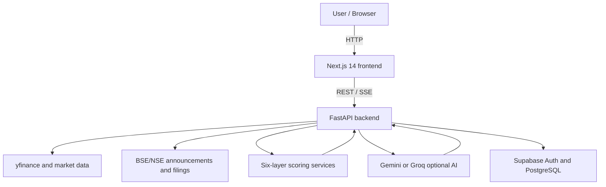

# Architecture

## System Architecture

## Components

| Component | Technology | Responsibility |
|---|---|---|
| Frontend | Next.js 14, React, TypeScript, Tailwind CSS | Authentication-aware dashboard, research pages, charts, watchlists, and portfolios |
| Backend API | FastAPI, Pydantic | Request routing, orchestration, validation, scoring, and sanitization |
| Market data | yfinance plus exchange/news feeds | Prices, fundamentals, technical history, announcements, and news inputs |
| AI layer | Google Gemini and Groq adapters | Optional summaries and sentiment/outlook synthesis from structured evidence |
| Database | Supabase/PostgreSQL | Authentication, persisted research data, watchlists, and portfolios |
| Scheduled jobs | Python scripts, scheduler, cron/PM2-ready configuration | Refreshing fundamentals, filings, news, and new-listing data |

## Data Flow

1. The browser requests a research view through the Next.js client.
2. The client calls the FastAPI route with the selected ticker and authenticated context.
3. Backend services load cached data or fetch provider data and normalize it into typed schemas.
4. Scoring services calculate the six layers and collect red flags and supporting metrics.
5. Optional AI providers summarize the structured result; sanitizers filter prohibited language.
6. The API returns the research payload for charts, score gauges, cards, and disclaimers.

## Security Considerations

- API keys and Supabase credentials are read from environment variables and excluded from Git.
- The source tree includes `.env.example` files, not live secrets.
- Supabase access is mediated through the application’s auth and database helpers.
- AI output is sanitized before it is shown to users.

## Scalability Notes

The backend services are organized so data ingestion, scoring, and presentation can be scaled independently. A production deployment can place multiple stateless API workers behind Caddy, move scheduled jobs to a managed scheduler, and add a shared cache for provider responses.

