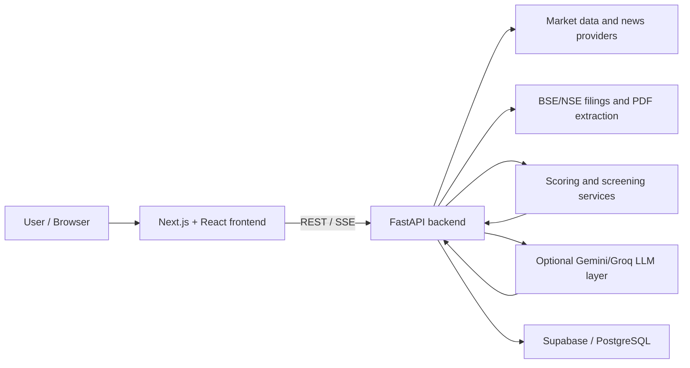

# Solution Overview

## What We Built

Vriddhi is an AI-assisted stock research platform for Indian equities. It collects public market, filing, and news inputs, computes a transparent six-layer research score, and presents the evidence in a focused Next.js dashboard.

## How It Works

1. A user searches for an Indian stock or opens a saved watchlist/portfolio.
2. The FastAPI backend retrieves cached or fresh market, fundamentals, news, and filing data.
3. Deterministic services calculate the six research layers and an overall score band.
4. Optional Gemini/Groq integrations generate summaries from the structured evidence.
5. Sanitization removes prohibited recommendation language, and the UI shows metrics, red flags, charts, and statutory educational disclaimers.

## Architecture Diagram

## Key Design Decisions

| Decision | Rationale |
|---|---|
| Deterministic six-layer score | Keeps the core result explainable and reproducible. |
| Separate AI summary layer | Allows natural-language synthesis without making the LLM the source of truth for numeric scoring. |
| Cached provider responses | Reduces rate-limit pressure and improves response time for repeated research. |
| Strict output sanitization | Keeps the prototype educational and avoids recommendation or price-target language. |

## IBM Technologies Used

No IBM service is currently wired into the application code, so this field is intentionally left empty in `submission.yaml` rather than overstated. The project is prepared for the IBM Bobathon submission format; any IBM service used during the competition should be added here with its concrete integration details.

